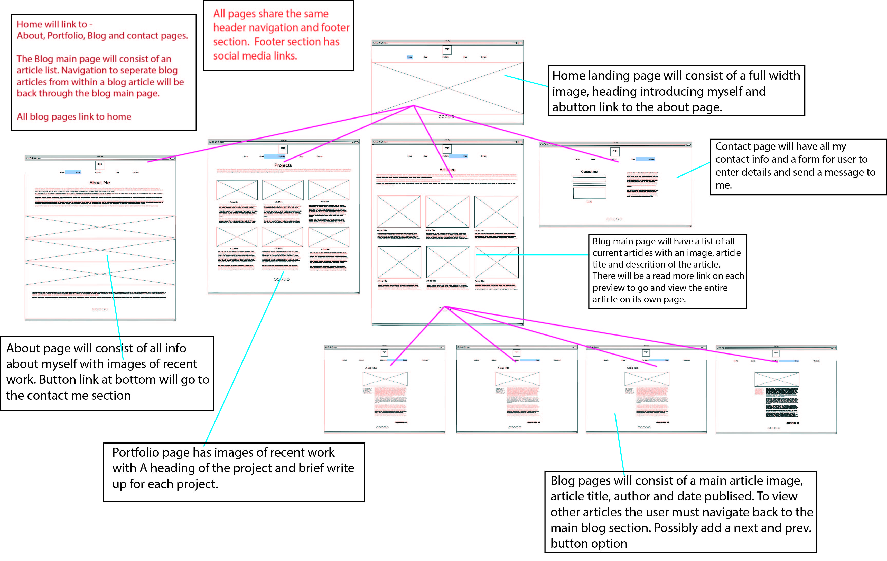

# **Matthew Viciulis Portfolio Assignment Coder Academy T1A2**

## **Documentation**

## **Links**

- [Porfolio Website](https://portfolio-website-sigma-umber.vercel.app/index.html)
- [Github Repo](https://github.com/MattViciulis/portfolio-website)
- [Slide Deck Presentation link]

## **Purpose**
*This website has been created for the purpose of showcasing my skills to prospective employers.
*To leave a positive impression regarding my work and who I am.
*A space for me to tell the world about who I am and what I do.

## **Target audience**
The main target audience for this site is Employers.

## **Functionality / features**
I have created this site with HTML, CSS, a clean aesthetic and easy navigation in mind. I went for an uncluttered feel using flexbox and grid making the layout resposive across all devices. I wanted information to be easy to read and access.

* "Landing/home" page is a single hero element with a bold site heading and description. 

* "About" page has a variety of images that outline past experience with a detailed explanation on who I am and what I do. There is a link for users to download my resume if they wish.
  
* "Portfolio" page has a brief description on what I have been working on and other information on my working life. There is a gallery of past projects with a detailed description of the work and other information,
  
* "Blog" page has a complete gallery listing of my blog articles with eye catching images and description of the articles. Eachh gallery item links to s seperate blog article page that has the complete article for the user to read.
  
* All of the blog articles are on a seperate page sp as to not add clutter to the website. The user can vavigate through the articles with a "prev/next" button or they can return to blog, home etc via the nav bar at the top of the page.
  
* "Contact" page has a listing of all the ways I can be contacted as well as an contact form with an option to leave me a message. 
  
* I have kept the site minimal so that I can minimise scrolling through the website, most pages are barely half a flick of the mouse or a touch of swipe to access the main nav bar.
All pages including blog posts have eye catching and easy to see social media links available.
I have kept colour to a minimum so that highlighted areas of interest link links or buttons jump out to the user.

## **Moodboard**
I started off with a moodboard to determine what the feel of my site would be like. I referenced other industry portfolios for inspiration on layout, feel and colour shcemes.

I gathered images and content that will be needed once decision on layout was made and started wire framing my ideas where I fleshed out the final layout.

After I researched layout and aesthetic options I started to gather images and content that will be needed once the final decision on layout was made.
I started wire framing out my ideas where I fleshed out the final layout.
## **Wireframes**

### Mobile Devices

### Tablets and Smaller Screens

### Desktops and Larger Screens

## **Screenshots of completed site**

### Phone Layout Screenshots

### Tablet Layout Screenshots

### Tablet Layout Screenshots

## **Tech Stack**

* Vscode for code editing
* HTML & CSS
* Balsmaiq and Illustrator for wire framing
* Photoshop for image editing
* Site deployment - Vercel
* Presentation - Powerpoint
* Code snippets - Codepen
